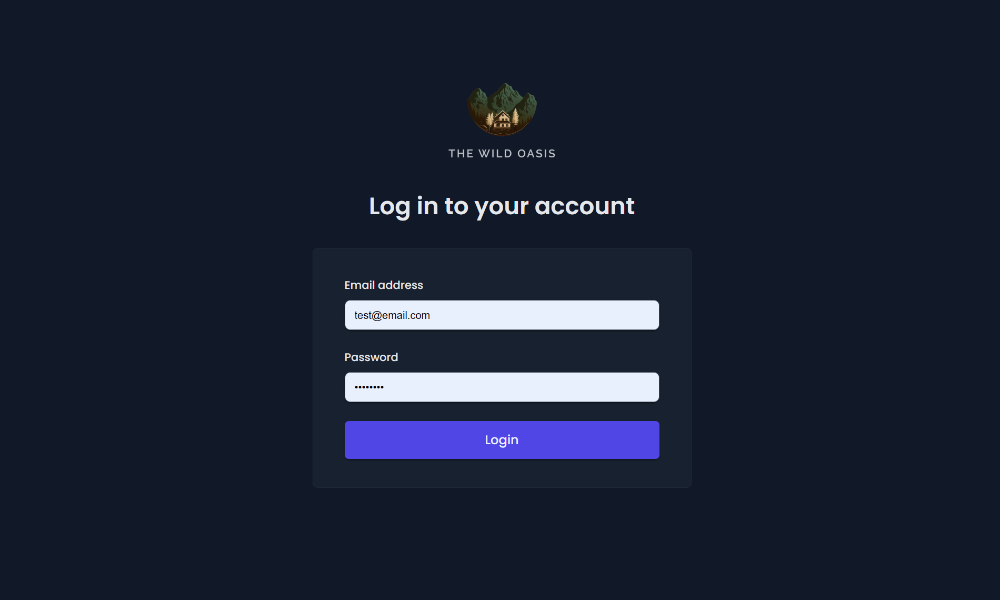
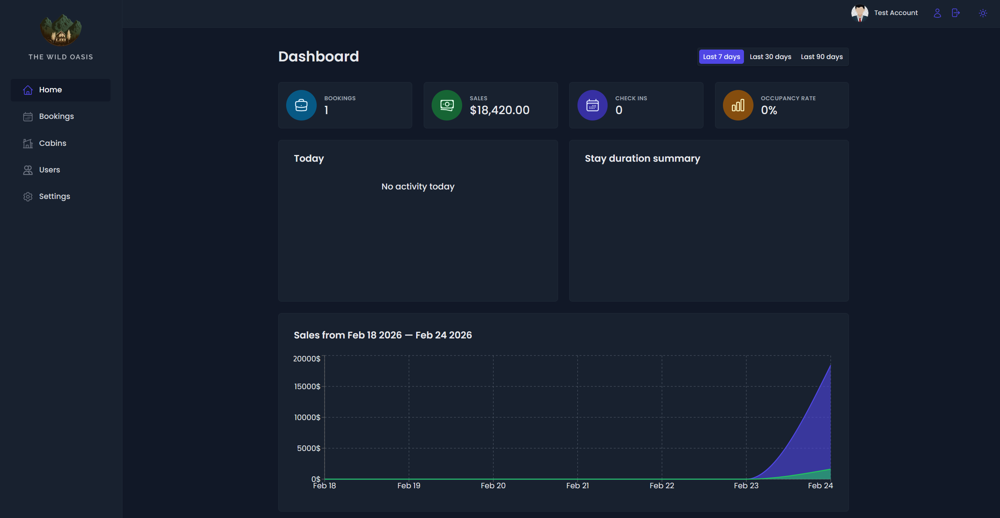
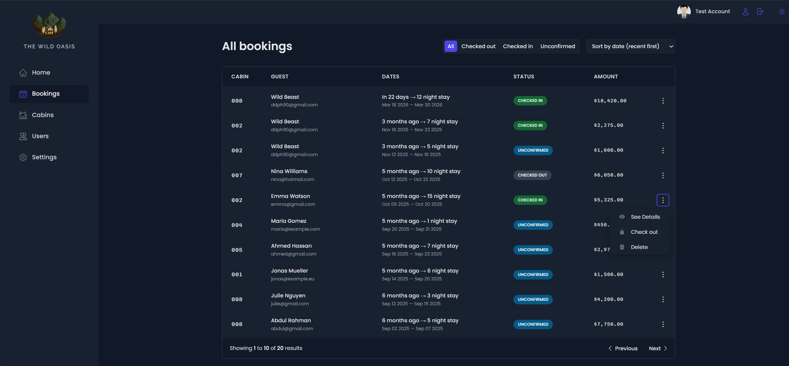
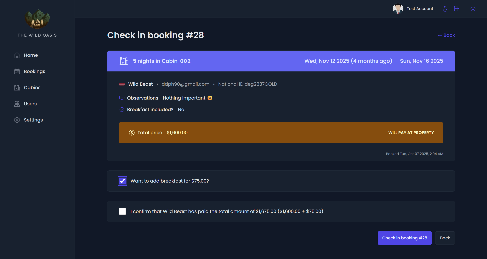

<div align="center">

  

  <h1>The Wild Oasis - Admin</h1>

  <h3>
    <a href="https://wild-oasis-admin-iota.vercel.app/">
      <strong>Live Site</strong>
    </a>
  </h3>

  <div align="center">
    <a href="https://wild-oasis-admin-iota.vercel.app/">View website</a>
    •
    <a href="https://github.com/Siraj-Adil/wild-oasis/issues">Report Bug</a>
    •
    <a href="https://github.com/Siraj-Adil/wild-oasis/pulls">Request Feature</a>
  </div>

  <hr>

</div>

<!-- Badges -->
<div align="center">


[](https://www.linkedin.com/in/siraj-adil-3b4022196/)

</div>

<!-- Brief -->


**The-Wild-Oasis** is the **admin-facing application** of a **two-part hotel booking platform**. This web app is designed exclusively for hotel employees to manage cabins, bookings, and guests. It is a modern React application built with **React 18**, **Vite**, and **Styled Components** and leverages **Supabase** as a backend.

---


</a>

## Live Site

Check out the live admin app here: [The Wild Oasis - Admin](https://wild-oasis-admin-iota.vercel.app/p)

## Customer Version

I also built a **customer version** of this app, where guests can view and book cabins, manage their bookings, and update their profiles. The repository is [here](https://github.com/Siraj-Adil/the-wild-oasis), and the live site is [here](https://the-wild-oasis-beta-neon.vercel.app/).

## 🚀 Key Features

- User authentication ensures that only hotel employees can access the system.
- Employees can manage their profiles, including uploading avatars and changing passwords.
- The app features a dashboard showing recent stats on bookings, check-ins, and sales.
- Manage cabins with the ability to create, update, or delete cabin records.
- Handle bookings with the ability to check guests in and out, and update booking statuses.
- Real-time updates for cabins and bookings using Supabase.
- Visual statistics with charts displaying sales, occupancy rates, and other important data.
- Fully functional dark mode for a customized user experience.

## 👨‍💻 Technologies Used

- **React 18** with functional components and hooks  
- **Supabase** for authentication and database integration  
- **React Query** for efficient data fetching and caching  
- **React Router DOM v7** for routing  
- **React Hook Form** for easy form handling and validation  
- **Recharts** for interactive charts and data visualization  
- **React Hot Toast** for user-friendly notifications  
- **Styled Components** for component-level styling  
- **Error Boundaries** with `react-error-boundary` for graceful error handling  

---

## ⚡ Setup Instructions

Follow these steps to run the project locally:

### 1. Clone the repository
```bash
git clone https://github.com/Siraj-Adil/wild-oasis.git
cd wild-oasis
```

### 2. Install dependencies:
```bash
npm install
```

### 3. Set up environment variables:
- Configure Supabase and add the necessary environment variables in a `.env` file. Check out the `env_example.txt` for reference.

### 4. Run the development server:
```bash
npm run dev
```

Then open [http://localhost:5173](http://localhost:5173) to view it.

## 🖼 Screenshots

### Login Page


### Dashbaord


### Bookings Page


### Checkin Booking Page



Created by **Siraj Adil**

## Acknowledgments

This app was developed as part of the [Udemy course](https://www.udemy.com/course/the-ultimate-react-course) by **Jonas Schmedtmann**. Special thanks to Jonas for his excellent teaching and guidance throughout the course.